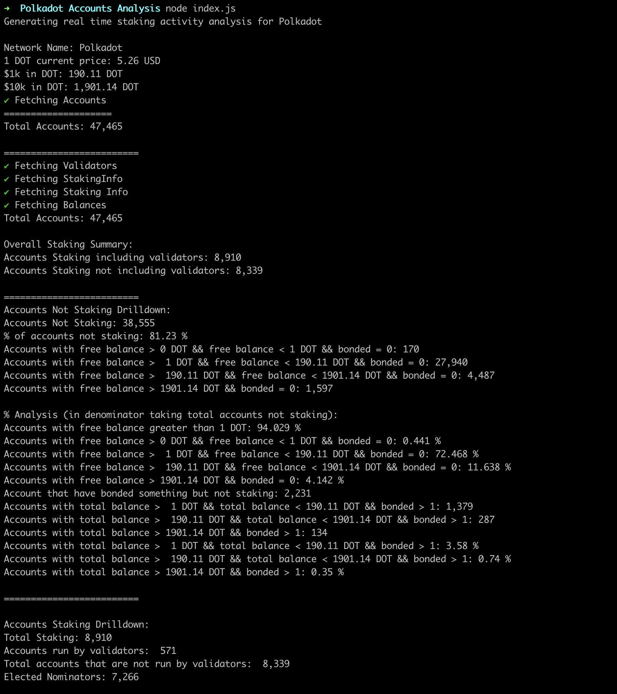

# polkadot-accounts-analysis

To run the script, make sure you have `yarn` and `nodejs` installed.

run `yarn` to install yarn dependencies

run `yarn add @polkadot/api` to install the necessary polkadot api packages

If no command line args are included, it defaults to the Polkadot network
`node index.js`

Include "kusama" as a command line argument to run this script on the Kusama network
`node index.js kusama`

# Result

